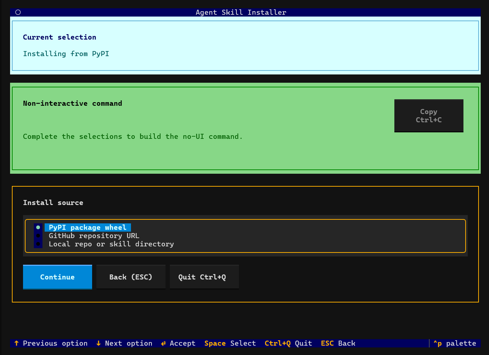

# Agent Skill Installer

|  | Description |
| --- | --- |
| Project | [](https://badge.fury.io/py/agent-skill-installer) [](https://pypi.org/project/agent-skill-installer/) [](https://pypi.org/project/agent-skill-installer/) [](LICENSE) |
| Status | [](https://github.com/omry/agent-skill-installer/actions/workflows/ci.yml) [](https://github.com/omry/agent-skill-installer/actions/workflows/publish.yml) |

`agent-skill-installer` installs agent skills for Codex and Claude Code from
local skill directories, GitHub repositories, or PyPI wheels. It supports repo
and global install scopes, writes discoverability blocks into the agent hook
files, and records enough install state to safely upgrade or uninstall skills it
owns.

Additional agent targets or installer functionality are open for discussion,
and pull requests are welcome.

## Install

```bash
python -m pip install agent-skill-installer
```

Run the interactive installer:

```bash
agent-skill-installer
```



Use `--no-ui` for scripts:

```bash
agent-skill-installer --no-ui install \
  --skill-path ./my-skill \
  --editable \
  --agent codex \
  --scope repo
```

## Documentation

| Audience | Start here |
| --- | --- |
| Installing a skill | [Installing Skills](docs/installing-skills.md) |
| Writing a skill directory or GitHub skill repo | [Authoring Skills](docs/authoring-skills.md) |
| Publishing a skill on PyPI or embedding the installer API | [Packaging And API](docs/packaging-and-api.md) |

## Examples

The [`examples/`](examples/README.md) directory contains runnable integrations:

- `examples/demo-installer/` is a complete Python package that carries a bundled
  skill and exposes a project-specific wrapper command.
- `examples/wheel-skill/` is a plain wheel-packaged skill for generic
  `--wheel-file` installs.
- `examples/api-install/` shows direct Python API usage without a wrapper
  console script.
